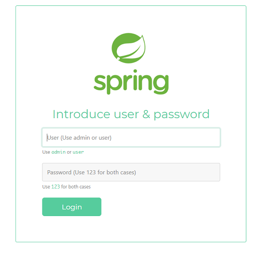
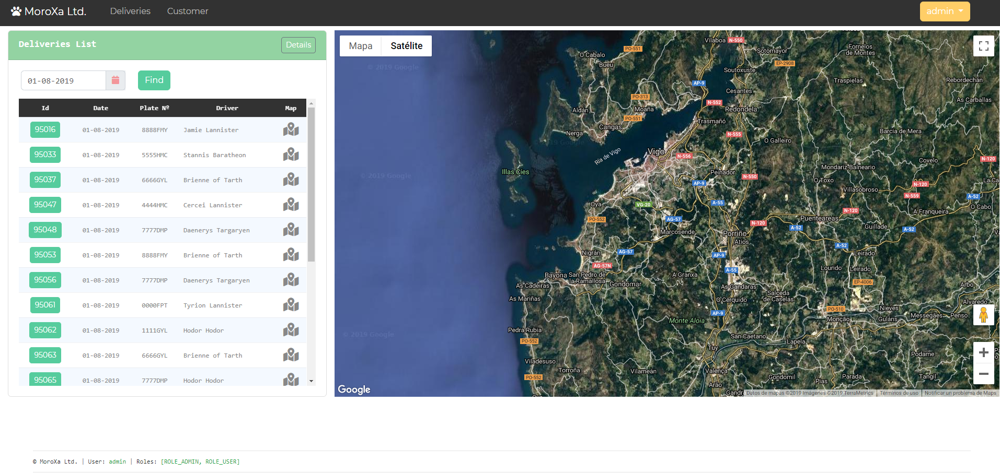
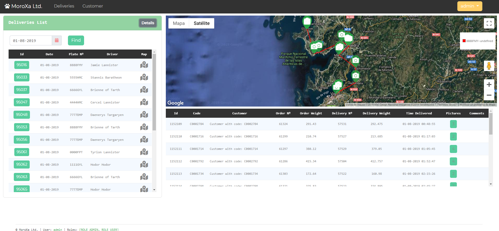
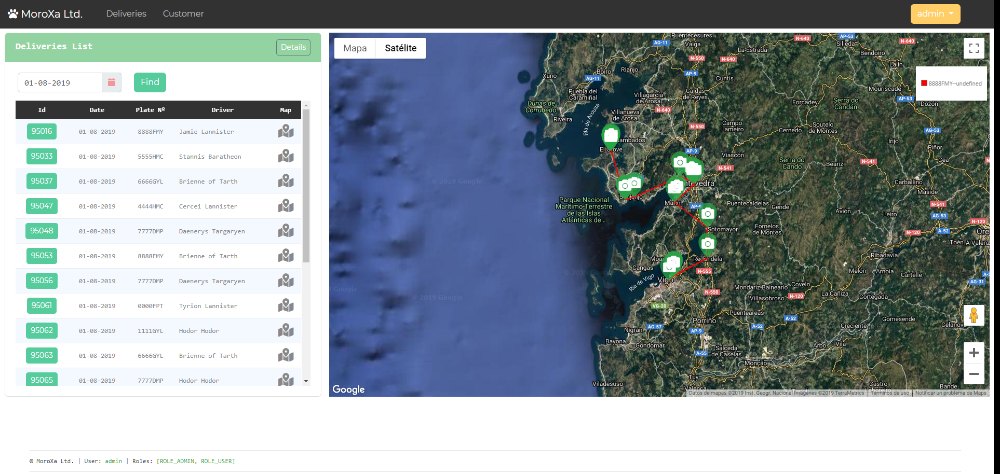
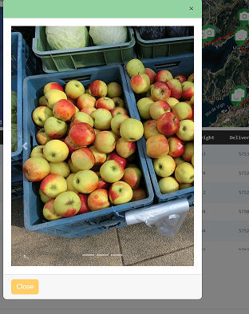
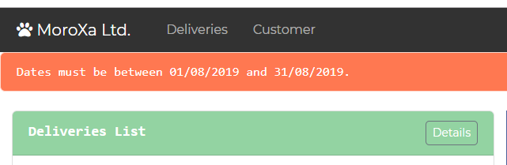
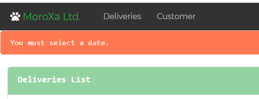
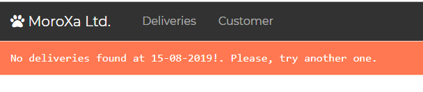

**Still under construction.**
## Spring Delivery  

This is a demo of a Spring Boot app to manage the deliveries of a company.

Try it [here.](http://spring-delivery-2020.eu-west-3.elasticbeanstalk.com )

#### Login Page
When the app runs, the initial screen is the following login page



Depending on the selected role, some features won't be available

#### Main Page

Once logged, the screen showed is the next one



The column ***Map*** will be available only to the role **admin**.

Clicking on the icon of the map, the details of the delivery will be shown below the map.
The map will display the geographic delivery points.



The button ***Details*** will switch the **Map** height.



#### Pictures

To see the pictures relative to a particular delivery, click on the number of the details table or on a **marker** of the Map.

I will appear a modal dialog with the photos.



#### Available Data 

The available dates to be selected are those between the 01/08/2019 and 31/08/19.

Any date selected out of that range will raise an error


 
If no date is selected the following will be shown 
 



If there are no deliveries for a particular date (E.g. Bank Holiday -> 15/08/2019)... 
 


**Pd: No fruit or vegetable were harmed in the development of this app**
